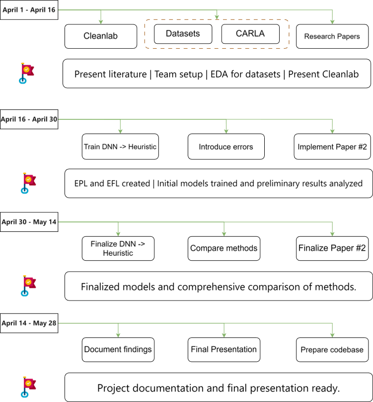

# Project Roadmap

## April 1 - April 16: Literature Review and Team Organization

### Tasks
- Select datasets for autonomous driving scenarios and perform exploratory data analysis (EDA).
- Review 4 state-of-the-art research papers on similar methods.
- Review CleanLab and CARLA software.
- Finalize team roles and responsibilities.

### Milestone
- Complete literature review and team setup.
- Initial EDA is done.
- Set vector for future work.

## April 16 - April 30: Error Introduction and DNN Training

### Tasks
- Implement Paper #2 (focus on Loss implementation).
- Implement two Deep Neural Network (DNN) methods.
- Continue exploration and integration of CleanLab and CARLA.
- Prepare scripts to introduce controlled errors into dataset labels.

### Milestone
- Datasets are ready with and without introduced errors.
- Initial methods are tested.

## April 30 - May 14: Model Testing and Method Comparison

### Tasks
- Continue refining Convolutional Neural Network (CNN) models.
- Test and evaluate different approaches for detecting label errors.
- Integrate CARLA for simulation and testing.

### Milestone
- Finalized models and comprehensive comparison of methods completed.

## May 14 - May 28: Final Review and Documentation

### Tasks
- Final adjustments based on feedback and test results.
- Document the project, methodologies used, results, and learnings.
- Prepare final presentation.

### Milestone
- Project documentation and final presentation are ready.
